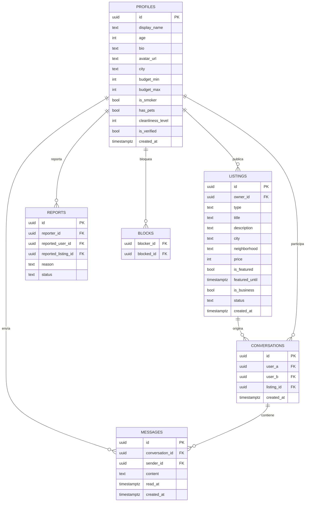

# Modelo de Datos — Roomie

> Diagrama entidad-relación en Mermaid. Se renderiza en GitHub y en VS Code
> (con la extensión de Mermaid). Mantenlo sincronizado con la skill
> `supabase-schema` y con las migraciones reales.

## Notas
- Toda tabla con RLS activado (ver skill `supabase-schema`).
- `profiles.id` = `auth.users.id` de Supabase.
- Las fotos de las publicaciones pueden ir en un `text[]` o en una tabla
  `listing_photos` aparte si necesitas orden/metadatos.
