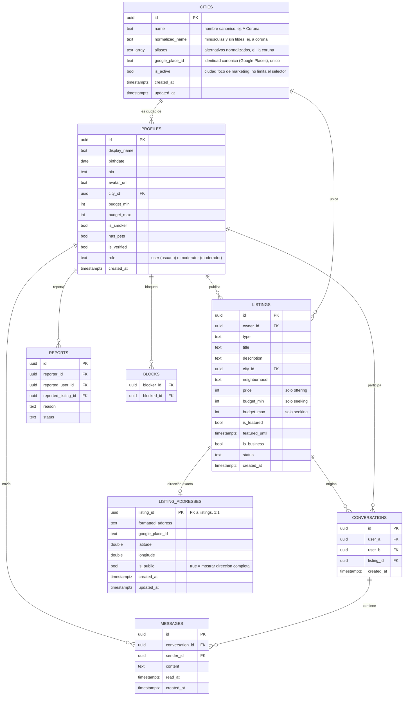

# Modelo de Datos — Room2gether

> Diagrama entidad-relación en Mermaid. Se renderiza en GitHub y en VS Code
> (con la extensión de Mermaid). Mantenlo sincronizado con la skill
> `supabase-schema` y con las migraciones reales.

## Notas
- Toda tabla con RLS activado (ver skill `supabase-schema`).
- `profiles.id` = `auth.users.id` de Supabase.
- Las fotos de las publicaciones pueden ir en un `text[]` o en una tabla
  `listing_photos` aparte si necesitas orden/metadatos.
- `cities` (RF-15): registro de ciudades poblado bajo demanda desde Google
  Places. El selector sugiere cualquier localidad de España vía Places
  Autocomplete; al elegir una, la RPC `get_or_create_city` (security definer)
  devuelve su fila creándola si es la primera vez. La identidad canónica es
  `google_place_id` (único); `normalized_name` ya NO es único (hay municipios
  homónimos en España) y solo sirve para casar filas antiguas sin place_id.
  `is_active` se reinterpreta como "ciudad foco de marketing" y no limita el
  selector. El cliente sigue sin escribir directamente (RLS solo SELECT);
  `city_id` usa `on delete restrict`.
- `listing_addresses` (CU-06): dirección exacta opcional de una publicación,
  1:1 con `listings` y en tabla propia porque RLS es por fila — así "mostrar
  solo el barrio" se garantiza en la BD. SELECT solo si `is_public` o si la
  publicación es del usuario; escritura solo del dueño. El barrio y la
  dirección vienen de Google Places (el catálogo `neighborhoods` se retiró):
  `listings.neighborhood` sigue siendo texto y almacena el nombre
  canónico elegido en el selector.
